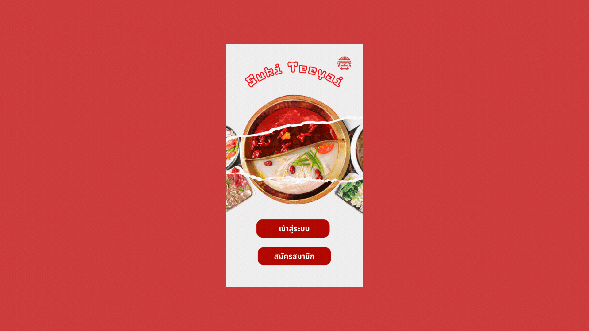

# 🥘 ShabuQueue

ShabuQueue is a simple mobile application designed for restaurant queue reservations. The app helps customers easily reserve a queue, while enabling restaurant staff to manage customer flow and table categories efficiently.

---

## 📱 Project Overview

This project was part of a **Mini Project in Mobile Device Programming**.  
Developed by a 7-person team, the app consists of two main roles: **Customer** and **Admin**.

- **Customer App:**
  - Reserve a queue
  - View current queue status
  - Cancel reservations
  - Edit personal profile information

- **Admin System:**
  - View customer queue list
  - Manage table categories
  - Add or update table types

I was responsible for:
- UI Design using **Figma**
- Frontend development using **Kotlin**
- Database structure and logic

---

## 🛠 Tech Stack

- **Frontend/Backend:** Kotlin
- **Database:** phpMyadmin
- **IDE:** Android Studio
- **Design Tool:** Figma
